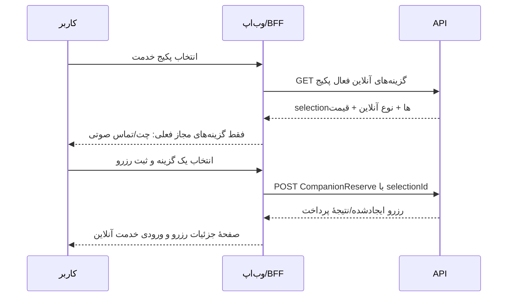
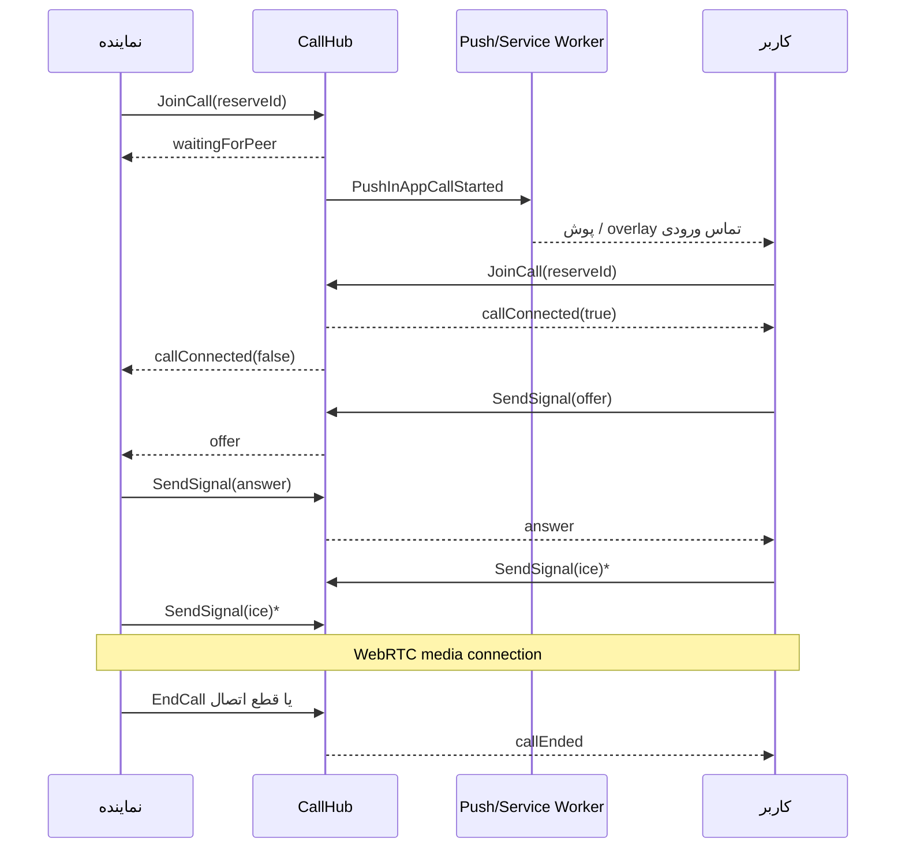

# مستند پیاده‌سازی وب‌اپ — خدمات آنلاین رزرو همراه

> نسخه: ۱۷ شهریور ۱۴۰۵  
> مخاطب: توسعه‌دهندهٔ وب‌اپ (Nuxt 4 / Vue 3)  
> محدوده: انتخاب خدمت آنلاین در رزرو، چت، تماس صوتی/ویدیویی درون‌برنامه‌ای و جریان تماس نماینده با کاربر

## 1. هدف و قرارداد این سند

«خدمت آنلاین» یک گزینهٔ فعال روی یک پکیجِ خدمت همراه است. کاربر هنگام رزرو، یکی از گزینه‌های فعال آن پکیج را انتخاب می‌کند و این انتخاب در رزرو ذخیره می‌شود. پس از آن، فقط طرف‌های همان رزرو می‌توانند چت یا تماس آن رزرو را ببینند و استفاده کنند.

وب‌اپ باید تمام درخواست‌های عادی را از BFF همان وب‌اپ (`/api/...`) بفرستد؛ **توکن JWT نباید در کد کلاینت یا URLهای API عادی قرار بگیرد.** BFF توکن Cookie را به API اصلی منتقل می‌کند. تنها استثنا، اتصال SignalR تماس است که طبق پیاده‌سازی فعلی، JWT را به شکل `access_token` در Query String اتصال Hub می‌فرستد.

پاسخ‌های عملیاتی API معمولاً HTTP 200 هستند، حتی وقتی عملیات ناموفق است. همیشه ابتدا این قرارداد را بررسی کنید:

```ts
if (result?.isSuccess !== true) {
  const message = result?.messages?.[0]?.item1 || 'خطایی رخ داد'
  // نمایش خطا به کاربر
}
```

برای خروجی‌های جستجو مانند فهرست پیام‌ها، داده معمولاً به شکل `totalCount` و `list` بازمی‌گردد و لزوماً wrapper `isSuccess` ندارد.

---

## 2. اصطلاحات و نقش‌ها

| اصطلاح | توضیح |
| --- | --- |
| رزروکننده / کاربر | `BookerId` رزرو؛ صاحب سفارش و دریافت‌کنندهٔ تماس ورودی |
| نماینده / ارائه‌دهنده | مالک خدمت همراه یا کاربرِ منصوب‌شده روی همان خدمت؛ تماس را با کاربر شروع می‌کند |
| مدیر | در سطح API دسترسی مدیریتی دارد؛ نباید بدون تصمیم محصول، در UI مصرف‌کنندهٔ این جریان باشد |
| پکیج | `CompanionAssistancePackage`؛ گزینهٔ خدمت آنلاین به آن وصل می‌شود |
| گزینهٔ آنلاین | `CompanionAssistancePackageOnlineSelection` شامل شناسه، قیمت، فعال بودن و نوع خدمت آنلاین |
| رزرو آنلاین | رزروی که `companionAssistancePackageOnlineSelectionId` دارد |
| `activationValue` | دادهٔ راه‌اندازی یک گزینه (مثلاً شماره/شناسهٔ سرویس خارجی). در UI فعلی نباید نمایش داده شود. |

دسترسی در سمت سرور رابطه‌محور است، نه صرفاً مبتنی بر صفحه: فقط رزروکننده، مالک خدمت همراه، یا کاربرِ منصوب‌شده روی آن خدمت مجازند. کلاینت نباید این کنترل را جایگزین مجوز سرور فرض کند.

---

## 3. وضعیت فعلی محصول: چه چیزی باید نمایش داده شود؟

کاتالوگ ممکن است چهار عنوان زیر را داشته باشد:

| گزینه | وضعیت فنی | وضعیت مجاز در انتخاب رزرو فعلی | رفتار مورد انتظار وب‌اپ |
| --- | --- | --- | --- |
| چت فوری با مربی | کامل | فعال | قابل انتخاب؛ بعد از ایجاد رزرو، ورود به `/companion-chat/:reserveId` |
| تماس فوری داخل برنامه با مربی | کامل | فعال | قابل انتخاب؛ تماس از `/call/:reserveId` با WebRTC و SignalR |
| ویدیو کال فوری با مربی | صفحه و موتور تماس آماده است | **فعلاً غیرفعال/پنهان** | در صفحهٔ انتخاب رزرو نشان ندهید؛ بدون تصمیم محصول فعال نشود |
| تماس فوری با شماره شخصی مربی | فقط گزینهٔ کاتالوگ/پیکربندی | **فعلاً غیرفعال/پنهان** | شماره یا `activationValue` را نمایش ندهید و لینک تماس نسازید |

فیلتر فعلی وب‌اپ فقط «تماس صوتی درون‌برنامه‌ای» و «چت پاستیل» را می‌پذیرد. پس وجود یک گزینه در پاسخ API به معنی مجاز بودن نمایش آن نیست.

### تفکیک دو مفهوم «تماس با کاربر»

1. **تماس نماینده با کاربر درون برنامه:** مسیر مورد تأیید فعلی است. نماینده دکمهٔ شروع تماس را می‌زند؛ کاربر پوش، overlay تماس ورودی یا نتیجهٔ `CallPending` را می‌گیرد و پاسخ می‌دهد.
2. **تماس با شمارهٔ شخصی مربی:** یک نوع خدمت خارجی است، نه تماس WebRTC. این مورد در UI فعلی عمداً پنهان است تا شمارهٔ شخصی افشا نشود. فعال‌سازی آن نیازمند تصمیم کسب‌وکار، متن رضایت و کنترل افشای شماره است.

### فعال‌سازی ویدیو در آینده

فقط پس از تأیید محصول/امنیت، هم‌زمان این موارد باید تغییر کنند: فیلتر `isAllowedOnlineOption`، تابع `getAllowedOnlineOptionKind`، متن و آیکن انتخاب، تست مجوز دوربین، سیاست TURN و سناریوهای حریم خصوصی. صرفاً افزودن گزینه به API کافی نیست.

---

## 4. پیش‌نیاز انتشار

1. مایگریشن `SeedCompanionReserveMessageTypeCodes` باید قبل از فعال‌سازی چت اجرا شده باشد. شناسه‌های معتبر نوع پیام این‌ها هستند:

   | نوع | شناسه |
   | --- | ---: |
   | متن | `140` |
   | تصویر | `141` |
   | صوت (آمادهٔ بک‌اند؛ UI فعلی ندارد) | `142` |
   | سیستمی (فقط سرور) | `143` |

   از شناسه‌های قدیمی `138` و `139` استفاده نکنید؛ آن‌ها در دیتابیس برای کدهای دیگری مصرف شده‌اند.

2. وب‌اپ باید روی HTTPS اجرا شود. `getUserMedia`، Push و Service Worker در HTTP قابل اتکا نیستند.
3. Reverse proxy باید WebSocket upgrade را برای `https://api.pastil.pet/hubs/call` عبور دهد و connectionهای طولانی SignalR را قطع نکند.
4. Push Subscription و Service Worker وب‌اپ باید فعال باشند. Push یک بهبود تجربه است؛ ورود کاربر به اپ باید با `GET /api/call/pending` نیز تماس منتظر را بررسی کند.
5. برای تماس پایدار اینترنتی، TURN لازم است. پیاده‌سازی فعلی فقط STUN عمومی Google (`stun:stun.l.google.com:19302`) دارد؛ در برخی شبکه‌های NAT/فایروال تماس وصل نمی‌شود. پیش از عرضهٔ جدی، coturn یا TURN دارای credential کوتاه‌عمر اضافه کنید.

---

## 5. جریان انتخاب خدمت و ساخت رزرو



### 5.1 دریافت گزینه‌های آنلاین

مسیر BFF موجود:

```http
GET /api/companionAssistancePackageOnlineSelection/endUserCompanionAssistancePackageOnlineSelection?CompanionAssistancePackageId={packageId}&PageSize=100
```

BFF آن را به این API اصلی می‌فرستد:

```http
GET /api/EndUser/CompanionAssistancePackageOnlineSelection?CompanionAssistancePackageId={packageId}&PageSize=100
Authorization: Bearer {token}
```

API فقط گزینه‌های `Active` را برمی‌گرداند. برای هر گزینه، حداقل `id`، `price`، `active`، `activationValue` و شیء `companionAssistancePackageOnline` (شامل `id`، `name` و `isInstant`) را در نظر بگیرید.

**قواعد UI:**

- اگر گزینهٔ مجاز وجود ندارد، پیام «برای این پکیج چت یا تماس درون‌برنامه‌ای فعالی تعریف نشده است» نمایش دهید و اجازهٔ ارسال رزرو آنلاین بدون انتخاب را ندهید.
- ابتدا اطلاعات nested گزینه را مصرف کنید؛ اگر برای سازگاری با دادهٔ قدیمی نامِ نوع خالی بود، از کاتالوگ EndUser (`/api/companionAssistancePackageOnline/endUserCompanionAssistancePackageOnline`) برای غنی‌سازی استفاده کنید.
- گزینه‌های چند پکیج را با شناسهٔ **نوع آنلاین** dedupe کنید، اما در payload همان `selection.id` مربوط به پکیج انتخاب‌شده را بفرستید.
- قیمتِ نمایش‌داده‌شده صرفاً برای UI است؛ قیمت نهایی و امکان انتخاب فقط در سرور معتبر است.
- `activationValue` را در payload رزرو، HTML، log یا analytics مرورگر ننویسید.

### 5.2 ایجاد رزرو

مسیر BFF موجود:

```http
POST /api/companionReserve/enduserReserve
Content-Type: application/json
```

فیلد مهم در payload:

```json
{
  "companionAssistanceId": 501,
  "companionAssistanceTimeId": 9001,
  "companionAssistancePackagesIds": [801],
  "userPetIds": [73],
  "doDate": "2026-09-17T11:00:00",
  "companionAssistancePackageOnlineSelectionId": 1201
}
```

`companionAssistancePackageOnlineSelectionId` فقط برای رزرو آنلاین ارسال می‌شود؛ برای خدمت حضوری/غیرآنلاین `null` است. `BookerId` را ارسال یا قابل اعتماد فرض نکنید؛ API آن را از JWT تعیین می‌کند.

پس از ایجاد رزرو، جزئیات را از مسیر BFF رزرو کاربر بگیرید و نوع کانال را فقط از دادهٔ خود رزرو استخراج کنید، نه از یک state قدیمی صفحه.

---

## 6. قرارداد نمایش کانال روی رزرو

برای تعیین نوع کانال، زنجیرهٔ زیر را از رزرو بخوانید:

```text
reserve
  .companionAssistancePackageOnlineSelection
  .companionAssistancePackageOnline
  .name
```

در پیاده‌سازی فعلی، تشخیص عنوان‌ها در `webapp/app/utils/companionCall.ts` قرار دارد. این utility باید تنها مرجع UI باشد؛ string comparison پراکنده در کامپوننت‌ها نسازید.

- نام دقیق تماس صوتی درون‌برنامه‌ای: `تماس فوری داخل برنامه با مربی`
- نام دقیق ویدیوکال: `ویدیو کال فوری با مربی`
- چت با تطبیق کلمات «چت، گفتگو، پیام» شناخته می‌شود و نام‌های خارجی مثل واتساپ، تلگرام، SMS و شماره تلفن رد می‌شوند.

روی صفحهٔ جزئیات رزرو:

- برای چت مجاز، CTA «ورود به چت» → `/companion-chat/{reserveId}`.
- برای تماس صوتی درون‌برنامه‌ای، CTA «تماس» → `/call/{reserveId}?peerName={encodedName}`.
- برای ویدیو/شمارهٔ شخصی در وضعیت فعلی CTA نسازید.
- اگر رزرو لغو شده یا `callEndDate` دارد، CTA تماس را غیرفعال کنید.

---

## 7. جریان تماس درون‌برنامه‌ای (صوتی و زیرساخت ویدیویی)

### 7.1 جریان مورد تأیید کسب‌وکار



**مبدأ تماس:** در UI مورد تأیید فعلی، نماینده شروع‌کننده است و کاربر پاسخ می‌دهد. Hub از نظر فنی هر طرف مجاز را وارد گروه می‌کند، اما دکمهٔ «تماس با کاربر» فقط باید در پنل نماینده/اپراتور باشد؛ برای کاربر، مسیر اصلی پاسخ‌دادن از پوش یا تماس منتظر است.

### 7.2 SignalR Hub

```text
wss://api.pastil.pet/hubs/call?access_token={jwt}
```

از `@microsoft/signalr`، `withAutomaticReconnect()` و composable موجود `useCallSignaling` استفاده کنید. نام گروه در سرور `call-{reserveId}` است؛ کلاینت نباید خودش نام گروه بسازد.

#### فراخوانی‌های Hub

| فراخوانی | ورودی | نتیجهٔ مورد انتظار |
| --- | --- | --- |
| `JoinCall` | `reserveId: number` | اعتبارسنجی رزرو و مجوز، ورود به گروه |
| `SendSignal` | `reserveId, type, payload` | ارسال offer/answer/ice به سایر اعضای همان گروه |
| `EndCall` | بدون ورودی | خروج از تماس و ثبت پایان تماس |

#### Eventهای دریافتی

| Event | استفاده در UI |
| --- | --- |
| `waitingForPeer` | نمایش «در انتظار پاسخ کاربر» و امکان لغو |
| `callConnected` با `shouldOffer: boolean` | اگر `true` بود offer WebRTC بسازید؛ در غیر این صورت منتظر offer بمانید |
| `signal` | typeهای `offer`، `answer` و `ice` را به `RTCPeerConnection` بدهید |
| `callEnded` | media trackها را stop، state تماس را ببندید و به جزئیات رزرو بازگردید |
| `callError` | پیام سرور را نشان دهید، UI تماس را ببندید و از retry بی‌پایان خودداری کنید |

### 7.3 WebRTC و مجوزها

- صوت: `navigator.mediaDevices.getUserMedia({ audio: true, video: false })`
- ویدیو (فقط پس از فعال‌سازی رسمی محصول): `audio: true` و `video: { facingMode: 'user' }`
- پیش از ورود به Hub، توضیح کوتاهی دربارهٔ میکروفون/دوربین نمایش دهید. اگر کاربر permission را رد کرد، هیچ JoinCall یا retry خودکاری انجام ندهید.
- `RTCPeerConnection` فعلی تنها STUN دارد. در نسخهٔ تولید پایدار، TURN با credential کوتاه‌عمر به `iceServers` افزوده شود.
- هنگام خروج، رد تماس، خطای permission و unmount: trackهای local را `stop()` کنید، peer connection را `close()` کنید و اتصال SignalR را قطع کنید. در قطع عادی، ابتدا `EndCall` را فراخوانی کنید.
- خروجی remote برای صوت با `<audio autoplay>` و برای ویدیو با `<video autoplay playsinline>` است. ویدیوی local را mute و PIP نشان دهید.
- audio autoplay ممکن است توسط مرورگر تا تعامل کاربر محدود شود؛ ورود از CTA پاسخ تماس را user gesture نگه دارید و حالت خطا/راهنما داشته باشید.

### 7.4 پوش و تماس ورودی

وقتی اولین اتصالِ غیررزروکننده به تماس وارد می‌شود، سرور Push نوع `PushInAppCallStarted` (شناسهٔ 63) برای کاربر می‌فرستد. payload شامل `type: "call"`، `reserveId`، `callerName` و actionهای `answer` / `decline` است.

رفتار مورد انتظار:

1. اگر تب وب‌اپ باز باشد، Service Worker یک `postMessage` با `type: 'incoming-call'` می‌فرستد؛ `useIncomingCallStore` باید overlay تمام‌صفحه با ringtone را فعال کند.
2. اگر اپ در پس‌زمینه/بسته باشد، notification سیستم نمایش داده می‌شود.
3. دکمهٔ پاسخ به `/call/{reserveId}?peerName=...` می‌رود.
4. دکمهٔ رد به همان صفحه با `?callAction=decline` می‌رود؛ صفحه باید بدون درخواست میکروفون به Hub وصل شود، `JoinCall` و سپس `EndCall` را بزند و خارج شود.
5. در شروع اپ، بازگشت به foreground و `pageshow`، مسیر زیر را بزنید تا پوشِ از دست‌رفته جبران شود:

   ```http
   GET /api/call/pending
   ```

   پاسخ: `{ "reserveId": number | null, "callerName": string | null }`.

**محدودیت مهم:** `CallSessionTracker` حافظه‌ای و تک‌نمونه است. پس تماس منتظر بعد از restart API از بین می‌رود و در چند instance API قابل اتکا نیست. برای چند instance باید tracker/pending-call در Redis یا store مشترک منتقل شود.

---

## 8. جریان چت خدمات آنلاین

### 8.1 قاعدهٔ ورود

صفحه: `/companion-chat/{reserveId}`

قبل از نمایش composer، رزرو را بخوانید (اول مسیر رزرو کاربر و در نقش نماینده fallback به مسیر اپراتور) و این شرایط را بررسی کنید:

- کاربر در رابطهٔ مجاز آن رزرو است؛
- رزرو لغو نشده است؛
- گزینهٔ انتخاب‌شده واقعاً چت پاستیل است، نه کانال خارجی؛
- نوع کانال با `getAllowedOnlineOptionKind(...) === 'chat'` مجاز است.

این بررسی برای UX است؛ API دوباره تمام قواعد را اعمال می‌کند.

### 8.2 APIهای BFF چت

| کار | مسیر BFF | API اصلی |
| --- | --- | --- |
| فهرست پیام‌ها | `GET /api/companionReserveMessage/messages` | `GET /api/CompanionReserveMessage` |
| ارسال پیام | `POST /api/companionReserveMessage/message` | `POST /api/CompanionReserveMessage` |
| حذف پیام | `DELETE /api/companionReserveMessage/delete?id={id}` | `DELETE /api/CompanionReserveMessage?id={id}` |
| ثبت خوانده‌شدن | `PUT /api/companionReserveMessage/read` | `PUT /api/CompanionReserveMessageRead` |
| اتصال تصویر به پیام | `POST /api/companionReserveMessage/attachment` | `POST /api/CompanionReserveMessageAttachment` |
| حذف attachment | `DELETE /api/companionReserveMessage/attachment?id={id}` | `DELETE /api/CompanionReserveMessageAttachment?id={id}` |
| ثبت reaction | `POST /api/companionReserveMessage/reaction` | `POST /api/CompanionReserveMessageReaction` |
| حذف reaction | `DELETE /api/companionReserveMessage/reaction?id={id}` | `DELETE /api/CompanionReserveMessageReaction?id={id}` |

مسیر backend `PUT /api/CompanionReserveMessageDelivered` نیز وجود دارد، اما جریان فعلی وب‌اپ از `Read` برای خوانده‌شدن گروهی استفاده می‌کند.

### 8.3 نمونهٔ payloadها

ارسال متن:

```json
{
  "companionReserveId": 7001,
  "senderUserId": 42,
  "companionReserveMessageTypeId": 140,
  "content": "سلام، برای شروع مشاوره آماده‌ام.",
  "replyToMessageId": null
}
```

`senderUserId` باید شناسهٔ کاربر فعلی باشد، اما سرور آن را اعتبارسنجی می‌کند. متن برای نوع Text اجباری و non-blank است. نوع `143` (سیستمی) نباید از کلاینت فرستاده شود.

ثبت خوانده‌شدن تا آخرین پیام دریافتی:

```json
{
  "companionReserveId": 7001,
  "lastMessageId": 9950
}
```

سرور فقط پیام‌های طرف مقابل را تا آن شناسه delivered/read می‌کند.

ثبت reaction:

```json
{
  "companionReserveMessageId": 9950,
  "reaction": "👍"
}
```

هر کاربر برای هر پیام یک reaction دارد: ارسال همان مقدار idempotent است و ارسال مقدار متفاوت، reaction قبلی را تغییر می‌دهد. حداکثر طول reaction، ۳۲ کاراکتر است.

### 8.4 تصویر

ترتیب صحیح آپلود تصویر:

1. اعتبارسنجی client-side: فقط `image/*`، اندازه و ابعاد مطابق سیاست File Service.
2. آپلود `multipart/form-data` به `https://file.pastil.pet/api/PictureUpload` با فیلد `PictureFile` و نمایش progress.
3. اگر پاسخ فایل موفق بود، یک پیام با `companionReserveMessageTypeId: 141` بسازید.
4. پس از دریافت `messageId`، attachment را ثبت کنید:

```json
{
  "companionReserveMessageId": 9951,
  "url": "https://file.pastil.pet/...",
  "thumbnailUrl": "https://file.pastil.pet/...",
  "fileName": "cat.png",
  "contentType": "image/png",
  "fileSize": 123456,
  "width": 1080,
  "height": 1080,
  "duration": null,
  "order": 0
}
```

سرور فقط attachment متعلق به پیام تصویرِ خود کاربر را می‌پذیرد؛ `contentType` باید با `image/` شروع شود، URL تکراری مجاز نیست و حذف آخرین attachment، پیام را هم حذف می‌کند. URL فایل را از پاسخ موفق File Service بگیرید؛ URL دلخواه کلاینت تولید نکنید.

### 8.5 دریافت، pagination و همگام‌سازی

- fetch اولیه را با `companionReserveId` و pagination بزنید؛ برای تاریخچهٔ قدیمی از `beforeMessageId` استفاده کنید.
- ترتیب پیام را از API ثابت نگه دارید و merge محلی را با `id` انجام دهید تا پیام optimistic تکرار نشود.
- store فعلی هر **۴٫۵ ثانیه** poll می‌کند؛ وقتی `document.hidden` است polling را متوقف کنید و در `visibilitychange` / focus دوباره fetch کنید.
- پس از دریافت پیام جدید از طرف مقابل، `Read` را با بزرگ‌ترین `lastMessageId` معتبر بزنید.
- Push نوع `PushCompanionReserveNewMessage` (شناسهٔ 65) کاربر را به `/companion-chat/{reserveId}` هدایت می‌کند. Push جای refresh/poll را نمی‌گیرد؛ reaction و وضعیت read با poll همگام می‌شوند.

### 8.6 قواعد مهم سرور

- پیام باید متعلق به یک رزروِ آنلاینِ چت باشد؛ با تغییر دستی `reserveId` نمی‌توان به رزرو دیگر پیام فرستاد.
- پیام فقط توسط فرستندهٔ خودش حذف soft-delete می‌شود؛ پیام سیستمی حذف‌پذیر نیست (به‌جز مدیر).
- `replyToMessageId` باید پیام همان رزرو باشد.
- برای ارسال متن/تصویر/صوت به طرف مقابل push ساخته می‌شود؛ برای reaction پوش جداگانه وجود ندارد.

---

## 9. state machine پیشنهادی UI تماس

```text
idle
  └─ شروع توسط نماینده → requesting-media → joining → waiting
      ├─ callConnected → connecting-webrtc → in-call
      ├─ callError / timeout / cancel → ended
      └─ callEnded → ended

incoming
  ├─ پاسخ → requesting-media → joining → connecting-webrtc → in-call
  └─ رد → declining → ended
```

نکات UX:

- در حالت `waiting` نام کاربر، وضعیت تماس و دکمهٔ لغو واضح باشد.
- برای waiting timeout (مثلاً ۶۰ ثانیه) طراحی کنید؛ در پایان `EndCall` را بزنید. مقدار نهایی timeout باید با محصول هماهنگ شود.
- در خطای microphone/camera، متن قابل فهم، دکمهٔ retry دستی و مسیر بازگشت به رزرو بدهید.
- status اتصال SignalR و WebRTC را جدا نمایش دهید؛ «به Hub وصل شد» معادل «صدا برقرار شد» نیست.
- از این صفحه به‌صورت هم‌زمان در چند tab وارد نشوید؛ tracker تعداد connection را می‌شمارد، نه تعداد اشخاص. UI بهتر است تماس فعال را در همان tab نگه دارد.

---

## 10. امنیت، حریم خصوصی و پایداری

1. به API مستقیم با توکن در `localStorage` وصل نشوید؛ BFF و Cookie جاری را استفاده کنید.
2. هرگز شمارهٔ شخصی، `activationValue`، JWT، SDP یا ICE candidate را در console production، analytics یا error tracker لاگ نکنید.
3. URLهای تصویر را پیش از render از File Service معتبر بگیرید و در UI از XSS در caption/message جلوگیری کنید؛ متن پیام plain-text نمایش داده شود.
4. برای همهٔ عملیات destructive (حذف پیام/attachment، پایان تماس) confirmation یا امکان undo UX مناسب در نظر بگیرید؛ اختیار واقعی با API است.
5. Hub اکنون signal payload را relay می‌کند. UI فقط `offer`، `answer` و `ice` با JSON قابل parse را بپذیرد و payload ناشناخته را نادیده بگیرد.
6. برای تماس چند instance، pending-call و شمارش session باید shared باشد؛ قبل از scale-out این مورد blocker است.
7. صحت زمان `callStartDate` و `callEndDate` سروری است؛ آن را در کلاینت محاسبه یا قابل ویرایش نکنید.

---

## 11. چک‌لیست پذیرش

### انتخاب و رزرو

- [ ] فقط selectionهای Active برای پکیج انتخابی خوانده می‌شوند.
- [ ] فقط چت و تماس صوتی درون‌برنامه‌ای در UI فعلی دیده می‌شوند.
- [ ] بدون انتخاب گزینه، رزرو آنلاین submit نمی‌شود.
- [ ] `selection.id`، نه `onlineOption.id`، در رزرو ارسال می‌شود.
- [ ] خطای business با `isSuccess === false` به کاربر نشان داده می‌شود.

### تماس

- [ ] نماینده تماس را شروع می‌کند و کاربر پوش/overlay دریافت می‌کند.
- [ ] در حالت push از دست‌رفته، بازکردن اپ `CallPending` را نمایش می‌دهد.
- [ ] پاسخ، رد و لغو بدون track یا اتصال SignalR باقی‌مانده تمام می‌شوند.
- [ ] تماس در رزرو لغوشده یا تماس پایان‌یافته وارد نمی‌شود.
- [ ] قطع اینترنت، permission denial، عدم وجود WebRTC و timeout پیام قابل فهم دارند.
- [ ] تماس از شبکهٔ NAT محدود با TURN تست شده است.

### چت

- [ ] متن با type `140` و تصویر با type `141` ارسال می‌شود.
- [ ] کاربر غیرمجاز یا رزرو لغوشده composer نمی‌بیند و API هم عملیات را رد می‌کند.
- [ ] تصویر ابتدا آپلود و سپس attachment معتبر ثبت می‌شود.
- [ ] read receipt با بزرگ‌ترین پیام دریافتی به‌روزرسانی می‌شود.
- [ ] polling هنگام hidden متوقف و پس از بازگشت اجرا می‌شود.
- [ ] پیام تکراری، reaction تکراری و pagination تاریخچه بررسی شده‌اند.

---

## 12. ترتیب پیشنهادی کار برای توسعه‌دهندهٔ وب‌اپ

1. utility مرکزی تشخیص کانال را مصرف/تکمیل کنید و قبل از هر UI، ماتریس مجازبودن بخش ۳ را اعمال کنید.
2. انتخاب گزینهٔ آنلاین و submit رزرو را با BFF پیاده کنید؛ حالت empty/error/loading داشته باشید.
3. CTAهای جزئیات رزرو را بر اساس نوع واقعی selection اضافه کنید.
4. چت متن، history، read receipt و poll را پیاده کنید؛ سپس تصویر و reaction را اضافه کنید.
5. صفحهٔ تماس صوتی، SignalR، WebRTC، permissions و cleanup را تکمیل کنید.
6. overlay تماس ورودی، Service Worker actions و fallback `CallPending` را اضافه/تست کنید.
7. پس از آماده‌شدن TURN و تصمیم محصول، ویدیوکال را پشت feature flag فعال کنید.
8. تماس با شمارهٔ شخصی را تا زمان تأیید محصول/حقوقی پیاده‌سازی یا نمایش ندهید.

---

## 13. فایل‌های مرجع در پروژه

| مسئولیت | فایل |
| --- | --- |
| سیاست کانال‌های مجاز و تشخیص تماس | `webapp/app/utils/companionCall.ts` |
| انتخاب خدمت آنلاین در رزرو | `webapp/app/composables/useOnlineSelections.ts` و `webapp/app/components/reserve/OnlineSelection.vue` |
| صفحهٔ تماس | `webapp/app/pages/call/[reserveId].vue` |
| SignalR کلاینت | `webapp/app/composables/useCallSignaling.js` |
| Hub و مجوز تماس | `backend/Api/Hubs/CallHub.cs` |
| tracker تماس منتظر | `backend/Api/Hubs/CallSessionTracker.cs` |
| overlay / listener تماس ورودی | `webapp/app/components/call/IncomingCallOverlay.vue` و `webapp/app/plugins/incoming-call-listener.client.ts` |
| Service Worker push | `webapp/app/service-worker/sw.js` |
| صفحه و store چت | `webapp/app/pages/companion-chat/[reserveId].vue` و `webapp/app/stores/useCompanionReserveChat.ts` |
| APIهای چت | `backend/Api/Controllers/CompanionReserveMessage*.cs` |
| مایگریشن کدهای چت و push | `backend/Persistence/Migrations/20260917063956_SeedCompanionReserveMessageTypeCodes.cs` |

این سند وضعیت فعلی کد را توصیف می‌کند. هر تغییر در نام گزینه‌ها، نوع‌های مجاز یا قرارداد Push باید هم‌زمان در utility وب‌اپ، API validation، تست‌ها و همین سند به‌روزرسانی شود.
